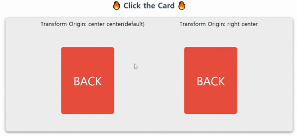

# Interactive Web

> 지바스크립트를 통해서 `INTERACTIVE`한 웹사이트를 만드는 다양한 방법이 존재한다. 여기서 `INTERACTIVE`라고 하면 엄청 화려하고 비까번쩍(?)한 것을 생각할 수 있다. 표현적으로 그러한 요소들(화려한 디자인, 창의적인 UI 인터랙션)이 들어간다. 의미적으론 `INTERACTIVE`라는 의미 그대로 다양한 기술을 통해서 클라이언트와 역동적이고 효과적으로 상호작용하는 방법을 나타낸다. 이 저장소는 어떠한 방식으로 `INTERACTIVE`함을 표현해야하는지 그 기술, 방법등에 대해 익히고 그 과정을 기록하려고 한다.

> 컨텐츠에 대해서 : 나 역시 배우는 입장이기에 여러 강의와 유투브, 블로그 등을 참고할 예정이다. 특히 [1분코딩](https://www.youtube.com/c/1%EB%B6%84%EC%BD%94%EB%94%A9/playlists)님의 강의와 영상을 참고하여 실습해볼 예정이다. 이 외에도 `HTML canvas`와 `p5.js`, `three.js`등은 한 번쯤 배워보고 싶은 라이브러리들이기에 차차 도전해보고자 한다.

> 작년(2020)에 이러한 시작했지만, 지속적으로 업데이트하지 못하였다.😅 내가 좋아하는 부분이기에 틈틈히 정리하여 나의 사이트 프로젝트 혹은 실무에서 적용해보고자 한다.

 
 

## Part1

> [Interactive Web](https://www.inflearn.com/course/interactive_web) 를 실습한 공간이다.

- [What I Learned](wil_md/part1_wil.md)

 
 

## Part2

> [CSS 3D Transform](https://3dtransforms.desandro.com/) 을 실습한 공간이다.

파트1을 만들어가면서 조금 더 인터렉티브함을 주기 위해선 좋은 자바스크립트 실력과 더불어 3D에 대한 감각이 중요함을 느꼈다. 거기에는 CSS를 이용한 `3D Transform`이 있다고 생각한다. 그리고 3D공간에 대한 이해는 많이 경험해보는 것이 좋은 것 같다. 그래서 3D Transform을 이용하여 몇가지를 만들어 보고자 한다.

- Card flip

  

- 3D Cube
- 3D Box
- 3D Carousel

 
 

## Part3

> 유사 Google T-Rex Game(일명 공룡 게임) 만들기

- [What I Learned](/wil_md/part3_wil.md)
