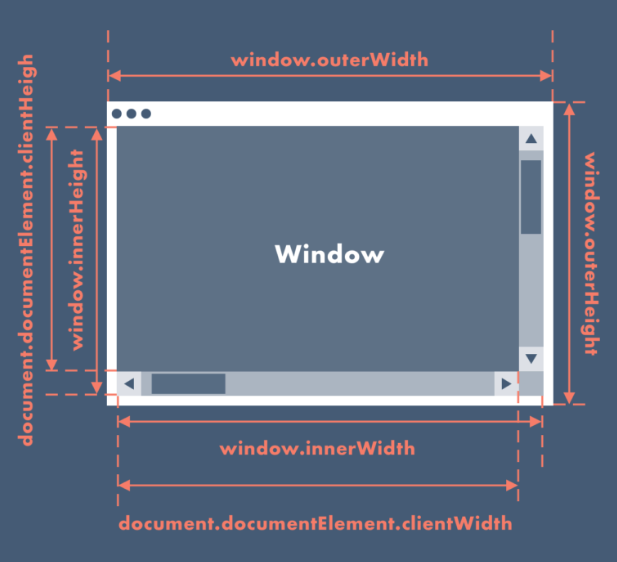
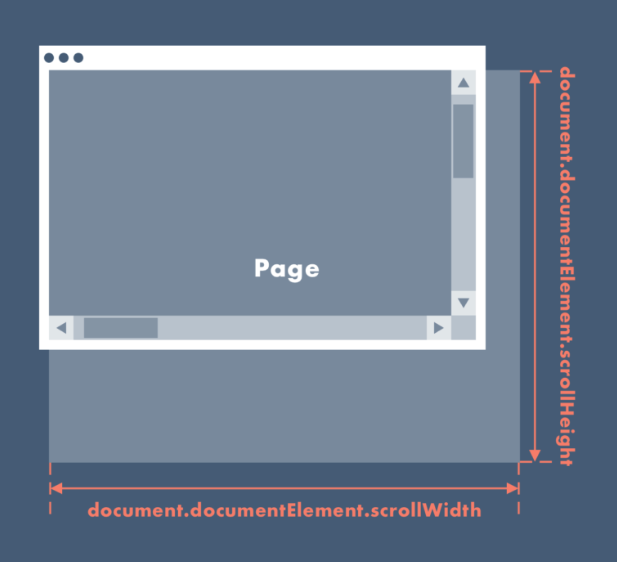
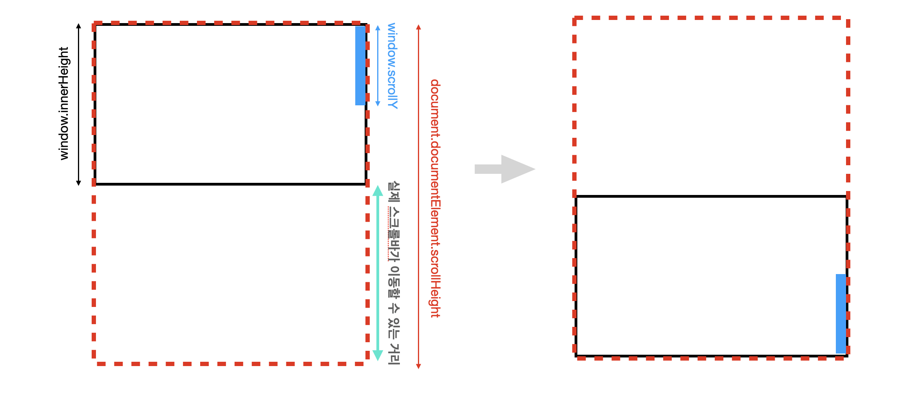

# What I Learned

<details>
  <summary>Reference Sites</summary>

- Mousemove

  - https://www.helloelva.com/
  - https://sirup.online/roll-and-bounce/
  - https://www.parad.am/
  - https://www.nytimes.com/paidpost/allbirds/the-view-from-above.html

- Parallax
  - [패럴럭스 콜랙션 사이트](https://noa-xyz.tistory.com/23)
  - https://neal.fun/deep-sea/
  - https://www.cabletv.com/the-walking-dead

</details>

## Mousemove

### 속성 정의 : about 좌표(coordinate)

- pageX : `전체 문서(document) ( + 스크롤되는 화면 포함)`를 기준으로 x, y 좌표를 반환

- clientX : `클라이언트 영역(뷰포트)` 내의 x, y 좌표를 반환

- offsetX : `이벤트 대상 기준`으로 위쪽좌측의 모서리를 (0,0)의 기준으로 하면 x,y 좌표를 반환

- screenX : `모니터 화면을 기준`으로 x, y 좌표를 반환, 모니터가 바뀌면 값이 바뀜(참고 : 듀얼모니터의 경우 모니터의 정렬에 따라서 값이 달라짐)

### mousemove 이벤트

```js
let x = 0,
  y = 0;

window.addEventListener('mousemove', (e) => {
  x = e.pageX;
  y = e.pageY;
});
```

> 마우스 움직임을 x, y값으로 할당하여 이를 이용해서 전제 문서 내에서 마우스 움직임에 따른 다양한 구현을 할 수 있다.

```js
let x = 0,
  targetX = 0;
const speed = 0.09;

window.addEventListener('mousemove', (e) => {
  x = e.pageX;
  y = e.pageY;
});

const animate = () => {
  targetX += (x - targetX) * speed;
};
window.requestAnimationFrame(animate);
```

> 마우스 움직임에 대한 가속의 느낌을 위한 공식 같은 코드 + requestAnimationFrame 이용

> speed값을 변경하면 다양한 효과를 얻을 수 있다.

## Parallax & Scroll

### 속성 정의 : about size

> [참고자료1](https://plantpot.works/4173) | [참고자료2](https://voltnuna.tistory.com/144) | [참고자료3](https://ko.javascript.info/size-and-scroll-window)

- 속성 분류

  - 브라우저 창 크기

    

    - window.outerWidth(outerHeight) : 메뉴바, 툴바 모두 포함한 전체 창 영역의 높이와 너비
    - window.innerWidth(innerHeight) : 메뉴바, 툴바 제외한, `스크롤바는 포함한` 안쪽 창 영역의 높이와 너비
    - document.documentElement.clientWidth(clientHeignt) : `메뉴바, 툴바, 스크롤바 모두 제외한` 안쪽 창 영역의 높이와 너비,

  - 페이지 크기

    

    - document.documentElement.scrollWidth(scrollHeight) : 실제 페이지가 스크롤 가능한 높이와 너비 (padding은 포함하지만, border, margin, scrollbar는 포함하지않는다.)
    - [참고] 위 속성은 브라우저마다, 혹은 상황에 따라서 예상과 다르게 작용하기도 한다. 그래서 `아래의 코드`처럼 사용하기도 한다. 왜 이렇게 해야만 하는지에 대해선 알아보기보단, 브라우상의 레거시로 남아있는 부분이라고 한다. 😱

      ```js
      const scrollHeight = Math.max(
        document.body.scrollHeight,
        document.body.offsetHeight,
        document.body.clientHeight,
        document.documentElement.scrollHeight,
        document.documentElement.offsetHeight,
        document.documentElement.clientHeight
      );
      ```

  - 스크롤 위치

    - window.scrollY(scrollX) : 현재 스크롤 위치 반환
    - document.documentElement.scrollTop(scrollLeft) : 현재 문서의 스크롤 위치 반환
      → 둘은 같은 값을 반환하기 때문에 둘 중에 골라서 사용하면 된다.(나는 전자를 주로 사용한다. 😇)

### 스크롤에 따르는 프로그래스바 그리는 계산식 ⭐️

- 현재 스크롤이 움직인 거리 / 스크롤이 움직이는 전체 거리

  → `window.scrollY /  document.documentElement.scrollHeight` 라고 생각할 수 있다.

  → 이렇게 하면 프로그래스바가 끝까지 다 채워지지않는 상황이 발생한다. 왜 그럴까??

  → 예를 들어보자. 스크롤이 움직일 수 있는 전체 거리가 `1000px`이라고 하자. 이 때 브라우저 창의 크기는 `700px` 이다. 스크롤을 내리면서 실제로 움직이는것은 브라우저 창의 크기이다. (스크롤의 시작점이 700px이고, 브라우저 창이 페이지의 끝에 닿게되면 스크롤을 끝까지 내린 것이 된다.) 즉, 실제로 스크롤이 움직일수 있는 거리는 `1000px - 700px` 인 `300px` 이다. 그림을 보면 좀 더 잘 이해가 될 수도... 🥲

  

### Parallax Layout 만들기

> 백그라운 이미지 위로 올라가는 느낌 만들 수 있는 레이아웃 (cf. 내가 고민했던 부분)

### 최적화?!

> 만들다보면 이미지 7개가 겹치다보니 정확한 원인은 모르겠지만 스크롤시 이미지가 깨지는 현상 발생. 왜 그럴까? 🤔 (in parallax3)
