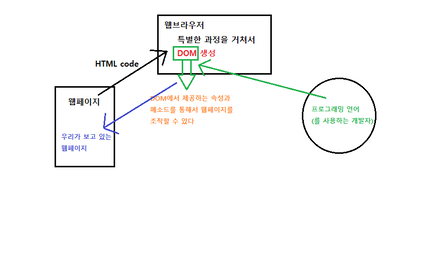
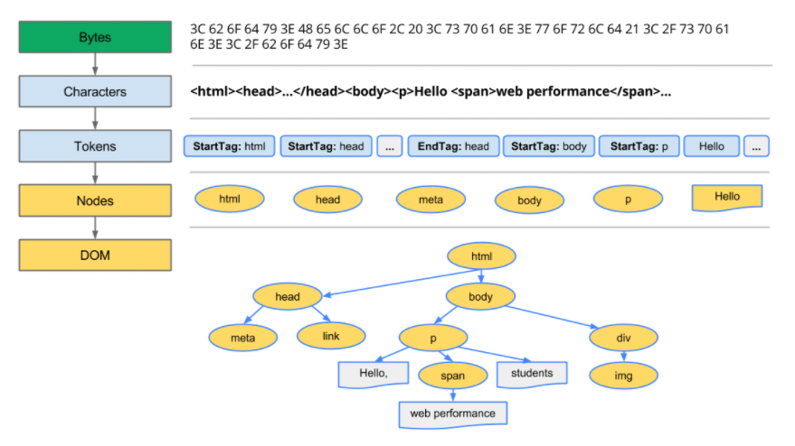
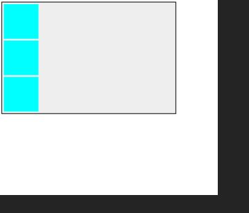

# DOM이란

> `Document Object Model` **문서 객체 모델** 이라고 한다

> HTML파일을 객체화시킨 `DOM TREE`를 바탕으로 그 객체들에 접근하여 웹페이지(문서)를 조작할 수 있는 방법들을 제공하는 `API`

## 궁금점1 : API가 무엇입니까?

> `Application Programming Interface`는 응용 프로그램에서 사용할 수 있도록, 운영 체제나 프로그래밍 언어가 제공하는 기능을 제어할 수 있게 만든 `Interface(인터페이스)`를 뜻한다.([위키](https://ko.wikipedia.org/wiki/API)) 이렇게 설명을 들으면 사실 정확히 이해하기 쉽지 않을 것이다. 😭

## 궁금점2 : Interface는 무엇입니까?

> 일반적으로 인터페이스란 서로 관련없는 것을 `연결해주는 시스템` 혹은 장치같은 것이라고 할 수 있다. 예를 들어서 내가 텔레비전을 보기 위해선 리모콘이 필요하다. 그래서 리모콘을 사용하여 텔레비전이라는 장치를 이용할 수 있게 된다. **이 때는 리모콘이 인터페이스가 된다.** 또 다른 예는 우리는 사람들과 대화를 하고 살아간다. 대화를 하기 위해선 한글이라는 언어를 사용해서 서로 간에 대화를 한다. **이 때는 한글이 인터페이스가 된다.**

<br />

### 요약하면, `API`란 `프로그램과 프로그램 사이를 연결해 주는 시스템`이라고 생각하면 가장 이해하기 쉬울 것 같다. 여기서 `프로그램`이라고 함은 약간 광범위하게 생각할 수 있다.

<br />

## 다시 설명을 해보잣 💥

> `개발자와 웹페이지 간의 상호작용(연결)`을 하기 위해선 무엇인가가 필요하다. HTML파일이 브라우저의 `특별한 과정`을 통해서 `DOM`이 만들어지고 그 DOM 안에는 개발자들이 접근해서 사용할 수 있는 `속성, 메소드들`이 존재한다. 그것을 이용해서 웹페이지를 조작할 수 있게 된다. 즉 DOM이란 개발자들이 웹페이지를 조작하는데 필요한 사용 가능한 도구들이 들어있는 집합이라고 할 수 있다.

> 특별한 과정을 통해서 `HTML파일`이 <u>좀 더 계층적이고 구조적인 모습으로 변형된 것</u>을 `DOM` 이라고 한다. 이 DOM을 통한 조작으로 최종적으로 보여지는 것에 사실은 우리가 마주하고 있는 `웹페이지`가 된다. _여기서 알 수 있듯이 엄밀하게 웹페이지와 HTML파일은 다른 것이라고 할 수 있다_.

> > 위의 API의 설명과 비교해보면 여기서는 개발자와 웹페이지 간의 연결이다. 그런데 개발자는 프로그램인가? 라는 의문이 생긴다. 사실 여기서 개발자는 프로그래밍 언어를 뜻한다. 쉽게 프로그래밍 언어를 사용하는 주체를 표현한 것이다. 즉 `프로그래밍 언어가 웹페이지에 어떻게 접근할지에 대한 것`이라고 보는 것이 정확한 표현인 것 같다



## How to make DOM

> DOM이 만들어 지는 과정

```HTML
 <!DOCTYPE html>
<html>
  <head>
    <meta name="viewport" content="width=device-width,initial-scale=1">
    <link href="style.css" rel="stylesheet">
    <title>Critical Path</title>
  </head>
  <body>
    <p>Hello <span>web performance</span> students!</p>
    <div></div>
  </body>
</html>
```



> 위의 HTML 소스가 DOM으로 변환되는 과정을 보여준다.

> `바이트 -> 문자 -> 토큰 -> 노드 -> 객체모델` 의 과정을 통해서 변환되어진다. 자세한 내용은 [참고](https://developers.google.com/web/fundamentals/performance/critical-rendering-path/constructing-the-object-model?hl=ko)를 클릭 🚀

> > 이 과정에 대해서는 추후에 깊이있게 공부할 기회가 있을거라고 생각한다. 우선은 `DOM`에 대한 기본적인 이해를 목표로 한다.

> 마지막에 DOM 이라고 적혀있는 이미지를 보면 각각의 태그들이 적혀있다. 그 태그들이 각각 다 `노드`에 속한다. 그리고 모두 객체이다. 이렇게 태그들의 상하관계(부모, 자식, 형제)를 직관적으로 표현한 것을 `DOM TREE` 한다.

> > 노드는 `계층적 단위`로서 각 계층마다 연결되어질 때 꼭지점(?)에 해당하는 것을 말한다. 각 노드마다 해당하는 객체의 정보를 담고 있다.

> DOM은 여기서 보이는 각각의 객체에 `접근`하여 `조작`할 수 있는 `방법`을 제공한다.

<br />

# DOM을 조작하는 방법

> 자주 사용하는 것들만 정리

> 많은 내용이 존재하기 때문에 필요할 때마다 `MDN`에서 찾아 보는 것을 추천 🚀

> 아래의 코드를 예시로 하여 그 밑에 각각의 속성과 메소드에 대해서 설명하였다.



```HTML
    <div class="container">
        <div class="item a"></div>
        <div class="item b"></div>
        <div class="item c"></div>
    </div>
```

```CSS
    .container {
        width: 500px;
        background-color: #eee;
        border: 2px solid black;
    }
    .item {
        width: 100px;
        height: 100px;
        margin: 5px;
        background-color: aqua;
    }
    .powderblue {
        background-color: powderblue;
    }
    .dashed {
        border: 3px dashed #243ed1;
    }
    .new {
        width: 200px;
        height: 200px;
        background-color: purple;
    }

```

```JavaScript
    const $container = document.querySelector('.container');
    console.log($container); //<div class="container"> ... </div>

    const $items = document.querySelectorAll('.item');
    console.log($items); //nodelist[3] ...

    const $item2 = document.querySelector('.item:nth-child(2)');
    console.log($item2); //<div class="item b"></div>
    $item2.setAttribute('data-index', 2);
    console.log($item2); //<div class="item b" data-index="2"></div>

    // $container.className = 'powderblue';
    // console.log($container); //<div class="powderblue">...</div>

    $container.classList.add('powderblue');
    console.log($container); // <div class="container powderblue">...</div>

    const $newItem = document.createElement('div');
    $newItem.classList.add('new');
    $container.appendChild($newItem);
```

## Access

-   document.querySelecotor('선택자')

    > 선택되어진 1개의 엘리먼트 객체를 반환

    > > 여기서 엘리먼트란 쉽게 말하면 HTML 태그말하고 그 HTML 태그를 사실 DOM TREE안의 노드의 엘리먼트를 말한다. 즉 `태그에 대한 엘리먼트 객체`를 가져오는 것이다. `객체`라는 사실이 중요하다.

-   document.querySelectorAll('선택자')

    > 같은 선택자를 가진 여러 개의 엘리먼트 객체 배열을 반환

    > 정확하게 `Nodelist`를 반환한다. Nodelist는 배열이 아니기 때문에 배열관련 메서드를 사용할 수 없다. 하지만 length와 각각의 index가 존재하기때문에 접근이 가능하다.

-   이외에서 getElementById, getElemnetsByTagName 등등이 존재하지만 위의 두가지가 가장 편하고 최근에 가장 널리 사용되는 방법이다. CSS 선택자를 이용하기때문에 같은 방식으로 어떠한 엘리먼트에도 접근이 가능하다

## Modify

> 가져온 각각의 엘리먼트들의 속성을 변경할 수 있다.

-   element.setAttrubute('data-index', 1)

    > 주어진 엘리먼트에 속성을 추가 data-index라는 속성을 추가할 수 있다. 참고로 data 속성은 엘리먼트의 표준이 아닌 속성을 추가할 수 있는 것으로서 알고 있으면 매우 유용하게 사용할 수 있다. [[참고 data속성](https://developer.mozilla.org/ko/docs/Learn/HTML/Howto/%EB%8D%B0%EC%9D%B4%ED%84%B0_%EC%86%8D%EC%84%B1_%EC%82%AC%EC%9A%A9%ED%95%98%EA%B8%B0)]

    > 반대로 `element.getAttribute('속성이름')`을 넣으면 원하는 `속성값`을 가져올 수 있다.

-   element.className = '클래스이름'

    > 해당 엘리먼트의 클래스 이름을 바꿀 수 있다. 단, 클래스 이름이 여러 개일 때 이렇게 사용하면 전체가 다 수정된다.

-   element.classList.add('클래스 이름')

    > 해당 엘리먼트에 클래스 이름을 추가할 수 있다. classList 속성에는 이 외에도 remove() / toggle() 등이 존재한다. 클래스는 DOM 조작을 위해서 자주 사용하는 속성이기 때문에 (💥특히 CSS와 관련지어서) 알아두면 매우 유용한다. [[참고](https://developer.mozilla.org/ko/docs/Web/API/Element/classList)]

-   이 외에도 다양한 속성들이 존재하고 그 속성들 안에 메서드를 이용해서 조작이 가능하다.

## Create

> 엘리먼트 생성

-   document.createElement('tag이름')

    > tag를 생성한다. 반환값은 생성된 (태그) `엘리먼트 객체`이다.

-   parentElement.appendChild(element)

    > 엘리먼트를 생성한다고 해서 그 DOM TREE 안으로 들어가는 것이 아니다. 반드시 그 안으로 추가를 해줘야만 그 안에 존재하게 된다. 원하는 parentElement를 선택해서 그 안의 자식 엘리먼트로 새로 생선된 엘리먼트를 추가할 수 있다.

    > 위의 메소드를 자식 엘리먼트로 1개만 추가가 가능하다. `append(element1, element2 ...)`는 자식 엘리먼트로 여러 개를 새로운 엘리먼트를 순서대로 추가할 수 있다.

# Ref

-   [DOM MDN](https://developer.mozilla.org/ko/docs/Web/API/Document_Object_Model/%EC%86%8C%EA%B0%9C)

-   [객체 모델 생성](https://developers.google.com/web/fundamentals/performance/critical-rendering-path/constructing-the-object-model?hl=ko)
