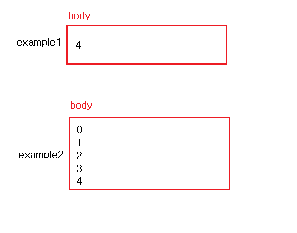

# appendChild()

> `아래 코드에 대한 의문`에서 시작한다.

```javascript
//Example 1
1   const something = document.createElement("p");
2
3   for (let i = 0; i < 5; i++) {
4       something.textContent = i;
5       document.body.appendChild(something); ✅
6   }
```

```javascript
//Example 2
1   for (let i = 0; i < 5; i++) {
2       const something = document.createElement("p");
3       something.textContent = i;
4       document.body.appendChild(something);
5   }
```

> 예시1과 예시2의 결과는 어떻게 될까? 예시1은 p태그가 한 번 생성했기 때문에 body태그 안에 p태그가 한 번 추가 된다. 이와는 다르게 예시2에서는 for문이 반복될 때마다 p태그가 생성하기 때문에 반복마다 p태그가 추가된다. 그 결과는 아래와 같다.



> 그렇다. 여기까지는 결과 자체가 이해가 된다. 그런데 내가 궁금한 것은 예시1에서 5번라인이다. 5번라인은 과연 몇 번 실행이 되는 것일까? 실행이 된다면 그 결과값으로 어떠한 것을 넘겨주는 것일까? 그래서 `appendChild()`에 대해서 차근 차근 분석해보고자 한다.

# 분석

## appendChild()는 결과값으로 추가한 노드를 반환한다.

> 위의 궁금했던 부분에서는 결과값을 찍어보면 5번의 같은 p 태그 반환된다. 즉 이 말은 `5번 실행`이 된다는 말이다. 하지만 결과값은 1개의 p태그만이 body 태그에 추가된다.

<br />

## Example : 아래 결과값은??

```HTML
<div calss="a">
    <span></span>
</div>
<div class="b"></div>
```

```javascript
const $a = document.querySelector('.a');
const $b = document.querySelector('.b');
const $span = document.querySelector('span');
$b.appendChild($span);
```

> 나는 이 문제를 틀렸다...😭 appendChild()가 작동을 안할거라고 생각하였다. 하지만 결과는`span 태그가 b-div 태그 안으로 이동한다`.

> [MDN appendChild()](https://developer.mozilla.org/ko/docs/Web/API/Node/appendChild)

```
만약 주어진 노드가 이미 문서에 존재하는 노드를 참조하고 있다면 appendChild() 메소드는 노드를 현재 위치에서 새로운 위치로 이동시킵니다. (문서에 존재하는 노드를 다른 곳으로 붙이기 전에 부모 노드로 부터 지워버릴 필요는 없습니다.)
이것은 한 노드가 문서상의 두 지점에 동시에 존재할 수 없다는 것을 의미합니다. 그래서 만약 노드가 이미 부모를 가지고 있다면 우선 삭제되고 새로운 위치로 이동합니다.
```

> 결과를 잘 들여다 보면, appendChild에 대한 새로운 기능에 대해서 알 수 있다. 지금까지 나는 `appendChild()`를 항상 새로운 엘리먼트를 생성하고 `그 엘리먼트를 부모 엘리먼트 하위로 넣어주는 작업`으로만 사용하였다. 그런데 이런 예시를 보면 `appendChild()`는 `존재하는 엘리먼트를 이동시킬 때`도 사용할 수 있다는 것을 알 수 있다.

<br />

## 최초 물음에 대한 답

> 그렇다면 최초 물음에 대해서 답할 수 있다. `document.body.appendChild(something)`은 5번 실행되는 것이 맞다. 하지만 첫번째(index 0) 실행될 때와 나머지(index 1,2,3,4)는 appendChild()가 작동하는 방식이 다르다. index 0 일 때는 새로운 엘리먼트를 body에 **추가**한다. index 2 부터는 `something` 이라는 `p 엘리먼트`가 body 안에 존재하게 된다. 그래서 appendChild()는 p 엘리먼트를 body 안으로 **이동**시키려고한다. 그래서 p 엘리먼트를 가져와서 body 안에 오버라이딩하게 되는 것이다.(그렇게 4번을 반복한다)

## 왜 appendChild()는 이렇게 작동할까?

> 먼저 트리 구조에 대해서 살펴보자. 트리구조는 노드로 이루어진 그래프형 자료구조를 말한다. 이전에 살펴본 `DOM트리`가 이러한 구조를 갖고있다.

> 몇가지 특징을 알아보면, 계층형 모델이다. 루트(맨위꼭지점)에서부터 내려오는 방향성있는 구조로 되어있다. 두개의 노드 사이를 연결 선은 유일하다. **모든 자식 노드는 한 개의 부모 노드만을 가질 수 있다.**

> 자식 노드는 한개의 부모 노드만을 갖는다는 점은 이미 엘리먼트가 존재할 때는 같은 엘리먼트가 복사되어서 다른 노드쪽에 들어갈 수 없을 말한다. 만약에 복사가 된다면, 같은 자식 노드가 두 개의 부모 노드를 갖게 되기 때문에 트리 자료구조의 특징을 위반하게 되는 것이다.

<br/>

# Ref

-   [Here is why appendChild moves a DOM node between parents](https://indepth.dev/here-is-why-appendchild-moves-a-dom-node-between-parents/)
