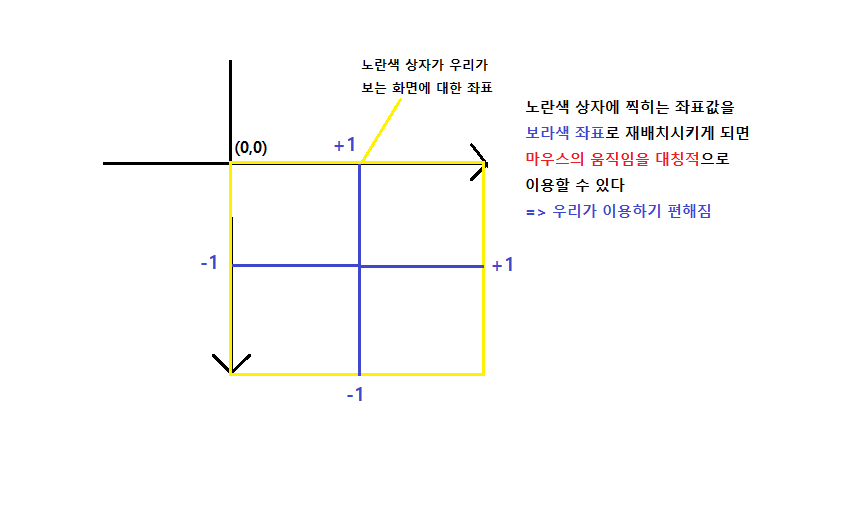

# WIL: What I Learned in this Project

> 프로젝트에서 배운 것을 정리해보자🚀

## transform: 3D의 방향성

```CSS
.wall-left {
    background-color: #f8f8f8;
    width: 1000vw;
    transform: rotateY(-90deg) translateZ(500vw);
}
```

-   상황

    > 3D 상에서 Z축으로 세워서 안쪽으로 스크롤 될 수 있도록 만드는 벽을 만드는 것

-   rotateY의 방향성

    > 방향은 y축을 기준으로 (실제 화면)앞으로 회전, 그렇게 되면 앞을 바라보고 있는 쪽이 z축의 양수 방향

-   rotateY된 벽을 translateX가 아니라 **translateZ**를 해야하는 이유
    > 분명히 rotateY인 Y축 기준으로 90도를 움직였기 때문에 이 엘리먼트는 x축으로 이동
    > 하여야 내가 원하는 효과(wall에 붙이기)가 구현될 것이라고 생각할 수 있다.
    > 하지만 rotate가 3D로 진행될 때 `그 요소의 기본축도 함께 rotate 된다`. 그렇기 때문에
    > x축이 아니라 z축으로 이동시켜야 내가 원하는 효과를 나타낼 수 있다.
    >
    > > **참고)** z축은 항상 transform시키려는 엘리먼트의 (3차원)앞뒤라고 생각하면 된다

## Scroll

> 스크롤의 좌표를 나타내는 값이 굉장히 많다💥 무엇을 어느 때 사용해야하는지 참 헷갈린다. 이전에도 정리했지만, 잊어버리기 전에 다시 한번 정리한다.

`Element.scrollHeight` 🎈 `Element.offsetHeight` ⭐

> 엘리먼트의 속성으로서 <u>해당 엘리먼트의 총 높이</u>를 나타낸다. `scrollHeight`는 엘리먼트의 경계선(border)를 포함하지 않는다. 반면에 `offsetHeight`은 경계와 패딩을 포함한다.

`Element.clientHeight` === `Element.offsetHeight`

`Element.clientWidth` === `Element.offsetWidth`

> 단, client~~ 는 경계선을 포함하지 않는다.

```
* document.documentElement.offsetHeight

>문서의 전체 높이 길이, `document.documentElement` 이 부분이 element 로서 `<html>`과 같은 의미이다. 즉 문서 전체를 의미한다.

>> `offsetHeight` 는 해당엘리먼트의 총 높이를 나타낸다. 정해진 값을 준다.

* document.body.offsetHeight

> 위와 같은 의미로서 body의 총 높이를 말한다.
```

`window.innerHeight` ⭐

> <u>브라우저 창</u>의 안쪽 높이, 현재 보이는 창의 높이, 현재 창의 높이이기때문에 창의 크기가 달라지면 변하게 된다. 이 값에 의존적인 값이 있다면, 창의 크기에 관계없이 항상 일정한 값을 같도록 하는 방법을 고안해야한다.

<br/>
<br/>

`Element.scrollTop`

> 수직 스크롤바가 생성이 되면 셋팅되는 값으로서 그렇지 않으면 0값을 갖는다. 엘리먼트의 스크롤한 위치를 나타낸다. 최상단에서부터 엘리먼트가 있는 윗면까지의 길이이다.

```
document.documentElement.scrollTop

> 문서의 전체 높이 길이, `document.documentElement` 이 부분이 element 로서 `<html>`과 같은 의미이다. 즉 문서 전체를 의미한다. 결국 위의 말은 문서에서의 스크롤한 위치를 가르키는 말이다.
```

`window.pageYOffset` === `window.scrollY` ⭐

> 위 두 개의 값은 사실상 같은 값이다. <u>스크롤한 길이(높이)</u>를 나타낸다. 문서가 얼마나 스크롤되었는지를 알려준다. 이것은 특정엘리먼트가 아닌 `window`에서 사용된다.

> > `Element.scrollTop` === `window.pageYOffset` === `window.scrollY` 이 3개는 결국 같은 값을 나타내지만 쓰임새가 조금씩 다르다.

## Mousemove

-   우리가 원하는 좌표로 계산하여 사용하는 방법



```javascript
const posX = -1 + (e.clientX / window.innerWidth) * 2;
const posY = 1 - (e.clientY / window.innerHeight) * 2;
```

-   좌표에 따른 rotate의 방향

    > 사실 이 부분은 아직 잘 이해가 되지않는다.

    > <u>rotateX는 y좌표에 영향을 받고, rotateY는 x좌표에 영향을 받는다.</u> 마치 x축 대칭은 y좌표만 바뀌고, y축 대칭은 x좌표만 바뀌는 경우와 비슷한 느낌이다.

    > rotateX를 하면 y좌표가 바뀌고, rotateY를 하면 x좌표가 바뀐다.
